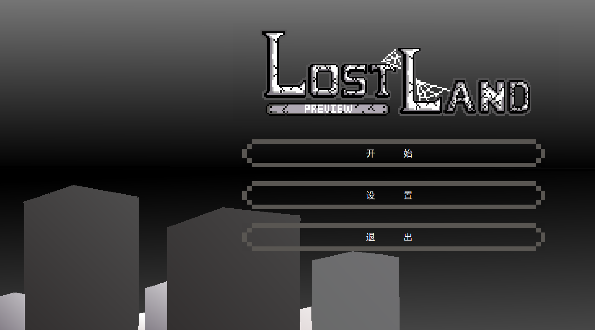

# Lost Land

A simple program. I just want to write a "3D" program  myself instead of using Unity or Unreal.

(Although it looks bad and has many bug)

## Module

* Dose it need any module?

## Note

* Please run the exe in directory "source" (If you would like to run the exe)

